# Deconfounding Actor-Critic Network with Policy Adaptation forDynamic Treatment Regimes

This repository contains the official PyTorch implementation of the following paper:

> **Deconfounding Actor-Critic Network with Policy Adaptation forDynamic Treatment Regimes**<br>
>
> **Abstract:** *Despite intense efforts in basic and clinical research, an individualized ventilation strategy for critically ill patients remains a major challenge. Recently, dynamic treatment regime (DTR) with reinforcement learning (RL) on electronic health records (EHR) has attracted interest from both the healthcare industry and machine learning research community. However, most learned DTR policies might be biased due to the existence of confounders. Although some treatment actions non-survivors received may be helpful, if confounders cause the mortality, the training of RL models guided by long-term outcomes (e.g., 90-day mortality) would punish those treatment actions causing the learned DTR policies to be suboptimal. In this study, we develop a new deconfounding actor-critic network (DAC) to learn optimal DTR policies for patients. To alleviate confounding issues, we incorporate a patient resampling module and a confounding balance module into our actor-critic framework. To avoid punishing the effective treatment actions non-survivors received, we design a short-term reward to capture patients' immediate health state changes. Combining short-term with long-term rewards could further improve the model performance. Moreover, we introduce a policy adaptation method to successfully transfer the learned model to new-source small-scale datasets. The experimental results on one semi-synthetic and two different real-world datasets show the proposed model outperforms the state-of-the-art models. The proposed model provides individualized treatment decisions for mechanical ventilation that could improve patient outcomes.*


# Framework

Paired survivor and non-survivor patients are resampled with similar estimated mortality risks to build balanced mini-batches.
DAC adopt an actor-critic model to learn the optimal DTR policies. The longitudinal patients' data are sent to a long short-term memory network (LSTM) \cite{lstm} to generate the health state sequences.
The actor network produces the probabilities of different treatment actions at next time step and is trained by maximizing the rewards generated by the critic network. To avoid punishing some effective treatment actions in EHR history of non-survivors, the critic network produces both short-term and long-term rewards. Short-term rewards can encourage the treatment actions that improve patients' health states at coming time steps, even if the patients ultimately suffer from mortality.
To further remove the confounding bias, a dynamic inverse probability of treatment weighting method is introduced to assign weights to the rewards at each time step for each patient and train the actor network with the weighted rewards.


# Data preprocessing
### Synthetic dataset
Simulate the all covariates, treatments and outcomes
```
cd preprocessing
python synthetic_mimic.py
```

### MIMIC-III dataset
```
cd preprocessing
python extract_mimic_data.py
python mimic3_dataset.py
python mech_dataset.py
python find_patients_wth_mechvent.py
```


# Train and test DAC
### Split dataset
```
cd code
python split.py
```

### Estimate mortality rate
```
cd code
python estimate_mortality.py
```


### Model training
```
cd code
python main.py
```

# Visualization of results

- Visualization of the action distribution in the 3-dimensional action space on MIMIC-III dataset.
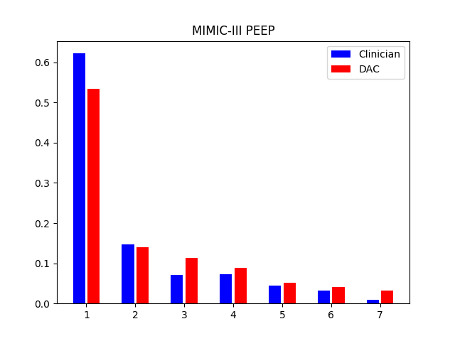
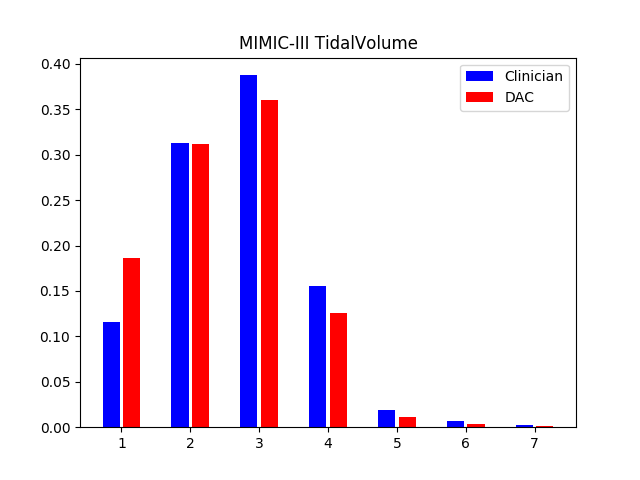
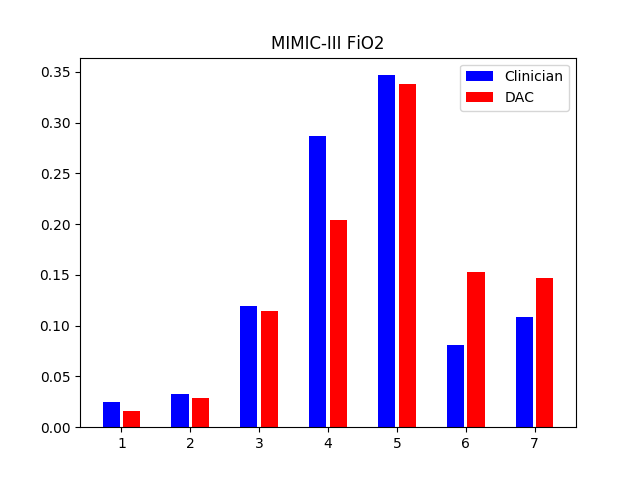


- Visualization of the action distribution in the 3-dimensional action space on AmsterdamUMCdb dataset.
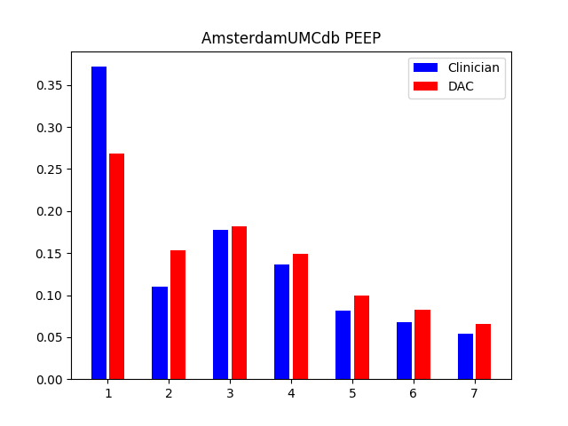
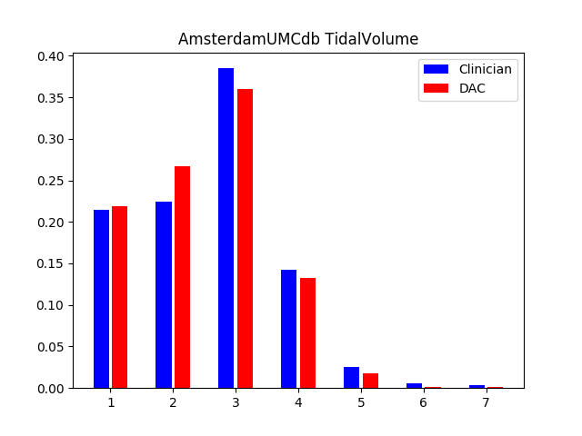
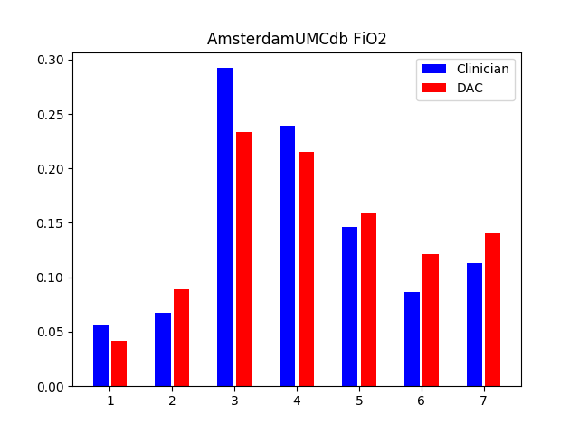

- The relations between mortality rates and mechanical ventilation setting difference (recommended setting - actual setting) on MIMIC-III dataset.
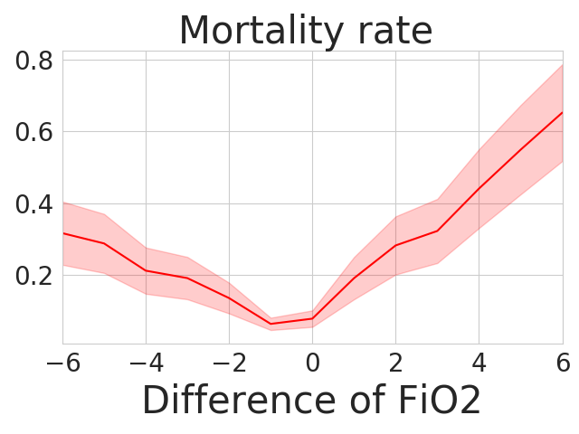
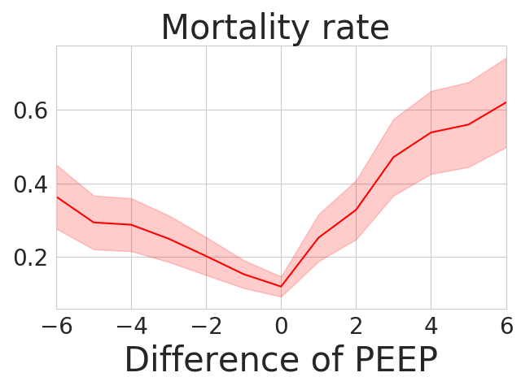
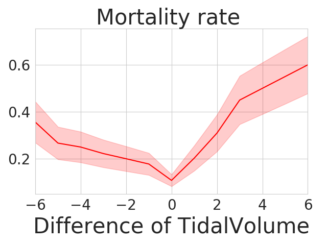

- The relations between mortality rates and mechanical ventilation setting difference (recommended setting - actual setting) on AmsterdamUMCdb dataset.
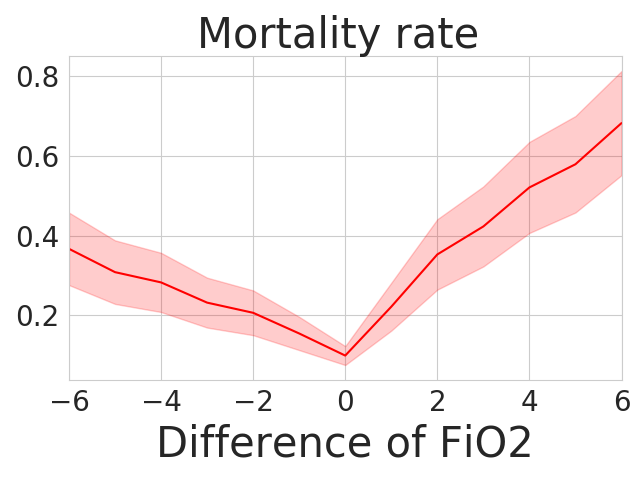
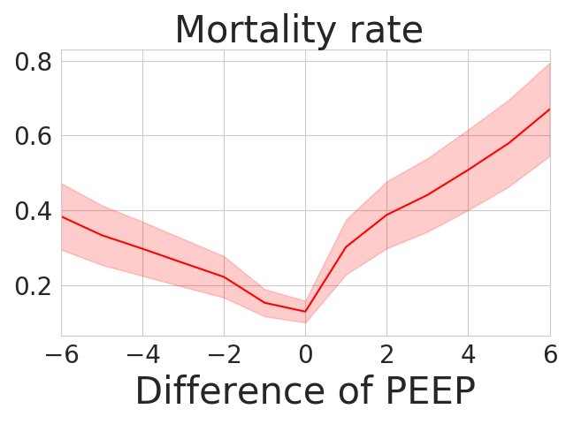
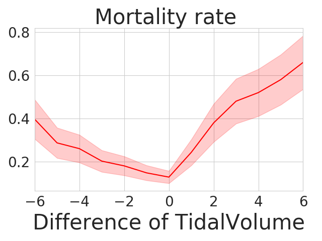

- The positive correlations between estimated mortality rate and predicted mortality probability on MIMIC-III and AmsterdamUMCdb datasets. 
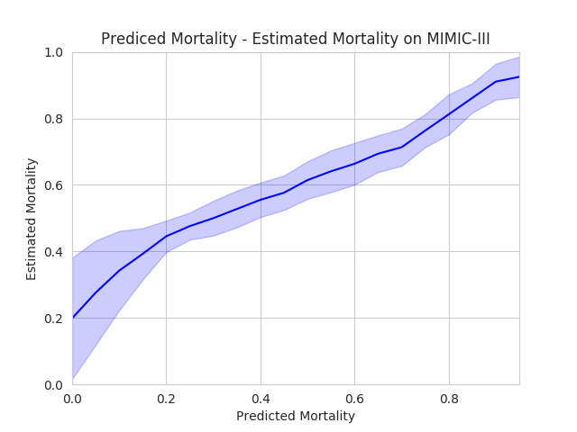
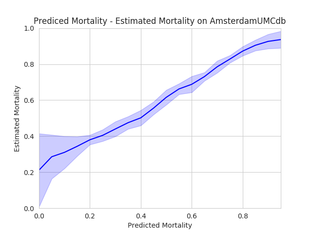

- Mortality-expected-return curve computed by the learned policies
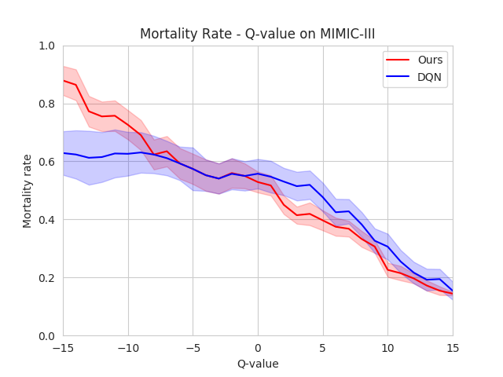

